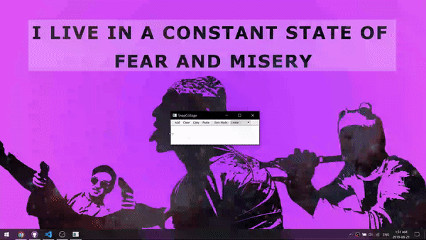

# py-snap-collage
Small application that works like Window's snipping tool but can compile multiple images into one collage

I was actually trying to find a project to learn Python, stumbled upon this idea when I wanted Window's Snipping Tool to be able to keep multiple images.

## Current progress
* Multiple snaps
* Linear arrangement
* Drag & zoom

